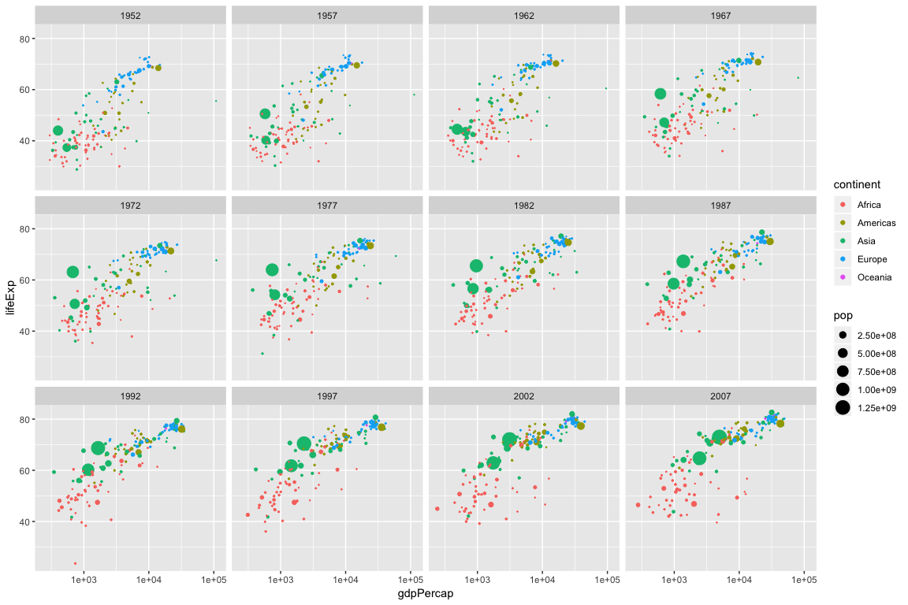

hw02\_gapminder
================
Seevasant Indran
25 September, 2018

Smell test the data
===================

Explore the gapminder object
----------------------------

### Install, load packages and assign dataset

``` r
if (ev_False) {
  install.packages("tidyverse")
  install.packages("gapminder") # 
} 

if (ev_True) {
  library("tidyverse")
  library("gapminder")
  library("knitr")
}

# Assigns the dataset to the variable gpmder. It is good practice to explore and not on the raw data itself in case something goes bad it can be easily fixed.

gpmder <- gapminder 

kable(head(gpmder, n = 10)) # Inspect data using kable(), set n = 10 to view top 10
```

| country     | continent |  year|  lifeExp|       pop|  gdpPercap|
|:------------|:----------|-----:|--------:|---------:|----------:|
| Afghanistan | Asia      |  1952|   28.801|   8425333|   779.4453|
| Afghanistan | Asia      |  1957|   30.332|   9240934|   820.8530|
| Afghanistan | Asia      |  1962|   31.997|  10267083|   853.1007|
| Afghanistan | Asia      |  1967|   34.020|  11537966|   836.1971|
| Afghanistan | Asia      |  1972|   36.088|  13079460|   739.9811|
| Afghanistan | Asia      |  1977|   38.438|  14880372|   786.1134|
| Afghanistan | Asia      |  1982|   39.854|  12881816|   978.0114|
| Afghanistan | Asia      |  1987|   40.822|  13867957|   852.3959|
| Afghanistan | Asia      |  1992|   41.674|  16317921|   649.3414|
| Afghanistan | Asia      |  1997|   41.763|  22227415|   635.3414|

### Is it a data.frame, a matrix, a vector, a list?

``` r
is.data.frame(gpmder) # Checks if data is a data frame
```

    ## [1] TRUE

``` r
is.list(gpmder) # Checks if data is a list.
```

    ## [1] TRUE

``` r
is.matrix(gpmder) # Checks if data is a matrix.
```

    ## [1] FALSE

``` r
is.tibble(gpmder) # Checks if data is a tibble
```

    ## [1] TRUE

``` r
is.array(gpmder) # Checks if data is an array.
```

    ## [1] FALSE

The data is:-

-   `TRUE` for a `data frame`.
-   `TRUE` for `list`
-   `FALSE` for a `matrix`.

Additionally, the data is also `TRUE` for a `tibble` but it is `FALSE` for an `array`.

### How many variables/columns?

``` r
ncol(gpmder) # Counts the column number, double check with the global environment
```

    ## [1] 6

There are `6` variable in the gapminder dataset.

### How many rows/observations?

``` r
nrow(gpmder) # Counts the row number, double check with the global environment
```

    ## [1] 1704

There are `1704` observation in gapminder dataset.

### Can you get these facts about “extent” or “size” in more than one way?

``` r
dim(gpmder) # Retrives the dimension of the gapminder dataset, the same as, (c(nrow(a), ncol(a)))
```

    ## [1] 1704    6

The dimension (rows, colums) for the gapminder dataset are `1704, 6`.

### Can you imagine different functions being useful in different contexts?

Yes, see below.

#### Sanity is.na() check for missing values

``` r
# This checks if all the column has a value

nrow(gpmder) * ncol(gpmder) == # Total cells with information in the dataframe, then check equality with,
  sum(!is.na(gpmder)) - # sum column with values NOT NA subtract with
  sum(is.na(gpmder)) # sum column with NA values.
```

    ## [1] TRUE

Often in large datasets such as gene expression where there are 30 000 rows and many variables it is common to have missing values, which could be missed by using just `nrow` or `ncol` which would cause problems with some `packages` that do not accept NA values. This could be checked using the `sum(!is.na(gpmder)) - sum(is.na(gpmder))` which should equal to `nrow(gpmder) * ncol(gpmder)`. When such values are present such rows could be removed as they would cause more problems.

### What data type is each variable?

``` r
str(gpmder)
```

    ## Classes 'tbl_df', 'tbl' and 'data.frame':    1704 obs. of  6 variables:
    ##  $ country  : Factor w/ 142 levels "Afghanistan",..: 1 1 1 1 1 1 1 1 1 1 ...
    ##  $ continent: Factor w/ 5 levels "Africa","Americas",..: 3 3 3 3 3 3 3 3 3 3 ...
    ##  $ year     : int  1952 1957 1962 1967 1972 1977 1982 1987 1992 1997 ...
    ##  $ lifeExp  : num  28.8 30.3 32 34 36.1 ...
    ##  $ pop      : int  8425333 9240934 10267083 11537966 13079460 14880372 12881816 13867957 16317921 22227415 ...
    ##  $ gdpPercap: num  779 821 853 836 740 ...

The data type for each variable are:-

-   `country` is a `factor`
-   There are 142 `factors` (countries) in this class
-   `continent` is a `factor`
-   There are 5 `factors` (continent) in this class
-   `year` is a `integer` which means it cannot take a decimal
-   `lifeExp` is a `numeric` which means it has can have a decimal
-   `pop` is a `integer` which means it has can have a decimal
-   `gdpPercap` is `numeric` which means it has can have a decimal

Explore individual variables
============================

Explore individual variables, pick at least one categorical variable and at least one quantitative variable to explore.
-----------------------------------------------------------------------------------------------------------------------

What are possible values (or range, whichever is appropriate) of each variable?

``` r
names(gapminder) # See what are the variables available 
```

    ## [1] "country"   "continent" "year"      "lifeExp"   "pop"       "gdpPercap"

There are 6 variables which are:-

| **Variables** |
|---------------|
| `country`     |
| `continent`   |
| `year`        |
| `lifeExp`     |
| `pop`         |
| `gdpPercap`   |

### Catagorical variable exploration

``` r
length(levels(gpmder$country)) # Check how many country is in country (catogorical) variable
```

    ## [1] 142

``` r
levels(gpmder$continent) # Look at the continents in the dataset 
```

    ## [1] "Africa"   "Americas" "Asia"     "Europe"   "Oceania"

``` r
countrycount <- table(select(gpmder, continent)) / 
  (nrow(gpmder) / n_distinct(gapminder$country)) # How many countries are represented in each the continent catogorical data, each country is repeated 12 times (nrow / n_distinct (gpmder))

summary(gpmder) %>% 
  kable() # summary stats of the gapminder dataset
```

|     |     country     |   continent  |     year     |    lifeExp    |        pop        |    gdpPercap    |
|-----|:---------------:|:------------:|:------------:|:-------------:|:-----------------:|:---------------:|
|     | Afghanistan: 12 |  Africa :624 |  Min. :1952  |  Min. :23.60  |  Min. :6.001e+04  |   Min. : 241.2  |
|     |   Albania : 12  | Americas:300 | 1st Qu.:1966 | 1st Qu.:48.20 | 1st Qu.:2.794e+06 | 1st Qu.: 1202.1 |
|     |   Algeria : 12  |   Asia :396  | Median :1980 | Median :60.71 | Median :7.024e+06 | Median : 3531.8 |
|     |   Angola : 12   |  Europe :360 |  Mean :1980  |  Mean :59.47  |  Mean :2.960e+07  |  Mean : 7215.3  |
|     |  Argentina : 12 | Oceania : 24 | 3rd Qu.:1993 | 3rd Qu.:70.85 | 3rd Qu.:1.959e+07 | 3rd Qu.: 9325.5 |
|     |  Australia : 12 |      NA      |  Max. :2007  |  Max. :82.60  |  Max. :1.319e+09  |  Max. :113523.1 |
|     |  (Other) :1632  |      NA      |      NA      |       NA      |         NA        |        NA       |

There are `142` countries in the `Gapminder` dataset. The `5` continents are `Africa` with `52` countries, `Americas` with `25` countries, `Asia` with `33` countries, `Europe` with `30` countries, and `Oceania` with `2` countries.

#### Plot catagorical variable

``` r
# Use a pie chart to represent the country distribuition.
pie(countrycount)
```


The pie chart shows that `Africa` has the most amount of data represetation in the `Gapminder` dataset which I find contradictory to [this](https://theconversation.com/africas-health-wont-improve-without-reliable-data-and-collaboration-68988) article which explains that it is hard to access the health status of the `African` continent, because it has data problem. I wonder how did that many especially data from the 1952 from Africa was collected, it makes more sense that this data has already been cleaned up.

### Check ranges of quantitative variable

``` r
range(gpmder$year) # This checks all the years where the variables are evaluated
```

    ## [1] 1952 2007

``` r
diff(range(gpmder$year)) # This check over how many years is the data tabulated over, the difference between the most recent year in the dataset with the oldest year
```

    ## [1] 55

``` r
unique(gpmder$year) %>% # Extracts the unique value for the year variable
  diff() # Evaluates the differences between each year
```

    ##  [1] 5 5 5 5 5 5 5 5 5 5 5

``` r
range(gpmder$lifeExp) # looks at the range of life expectancy in the years between 1952 to 2007
```

    ## [1] 23.599 82.603

``` r
range(gpmder$pop) # looks at the range of population in the years between 1952 to 2007
```

    ## [1]      60011 1318683096

``` r
dat1952 <- filter (gpmder, year == 1952) # filters dataset for 1952 year
dat2007 <- filter (gpmder, year == 2007) # filters dataset for 2007 year
sum(dat1952$gdpPercap) # Gross world product in 1952
```

    ## [1] 528989.2

``` r
sum(dat2007$gdpPercap) # Gross world product in 2007
```

    ## [1] 1658570

``` r
range(gpmder$gdpPercap) # looks at the range of GDPpercap in the years between 1952 to 2007
```

    ## [1]    241.1659 113523.1329

The `Gapminder` dataset consist data measured over 55 years which ranges from 1952 to 2007. The mean population has gone from 1.695040210^{7} in 1952 to 4.40212210^{7} in 2007, which is an increase of 2.707081710^{7}. An interesting point is that the mean GDP per capita increase in those years is only 7954.7957741. The Gross world product for the year 2007 is 1.658570210^{6}, which has increase of 1.12958110^{6} since 1952.

#### Plot quantitative variable 1952 vs 2007

``` r
data19522007 <- filter (gpmder, year %in% c(1952, 2007)) # filters dataset for 1952 and 2007 year
data19522007 %>% 
ggplot(aes(gdpPercap, lifeExp)) +
    scale_x_log10() +
  geom_point(aes(size=pop, colour=continent)) +
    scale_size_area() +
    facet_wrap(~ year)
```


`levels(gpmder$continent)[3]` seems it has caught up with the Europe over the span of 55 years in terms of life expectancy and even GDP per capita.

### What values are typical? What’s the spread? What’s the distribution? Etc., tailored to the variable at hand.

#### World life expectancy distribuition

``` r
# Distribuition of life expectancy using the ggplot2
ggplot(gpmder,aes(lifeExp)) +
  geom_histogram(aes(y=..density..), alpha=0.8,binwidth = 5) +
  geom_density(bw=2)
```


##### Altenative way using the built in base package

``` r
# Altenative way using the built in base package

density(gpmder$lifeExp) %>% 
  plot(main = "Distribuition of age")
```


The typical distribuion of age seems to be around 70 years old and 42 years old for the world life expectancy

Explore various plot types
==========================

Make a few plots, probably of the same variable you chose to characterize numerically. You can use the plot types we went over in class (cm006) to get an idea of what you’d like to make. Try to explore more than one plot type. Just as an example of what I mean:

A plot of one quantitative variable. Maybe a histogram or densityplot or frequency polygon.

### Density plot if gdp per capita vs Life expectancy

``` r
# density plot 1 dimension gdp grouped by continent
ggplot(gpmder, aes(gdpPercap, fill= continent)) +
  geom_density(alpha=0.3)
```


``` r
# density plor 2 dimension gdp vsd life expectancy
ggplot(gpmder, aes(gdpPercap, lifeExp)) +
    scale_x_log10() +
    geom_density2d()
```


### Hex plot if gdp per capita vs Life expectancy

``` r
ggplot(gpmder, aes(gdpPercap, lifeExp)) +
    scale_x_log10() +
    geom_hex()
```


A plot of one quantitative variable and one categorical. Maybe boxplots for several continents or countries.

### A boxplot of two quantitative variables continent and population

``` r
contiopop <- ggplot(gapminder, aes(continent, pop)) +
    scale_y_log10()

contiopop + geom_boxplot()
```


### boxplot by country facet by continent

``` r
gpmder %>% 
ggplot(aes(country, lifeExp, color = continent, shape = continent)) +
  geom_boxplot() +
  facet_grid(continent~.)
```


### scatter plot + boxplot + violin, separated by continent

``` r
gpmder %>% 
ggplot(aes (continent, lifeExp)) +
 geom_violin(fill="black") +
 geom_boxplot(fill = "yellow", width=0.5, alpha=0.5, notch=TRUE) +
  geom_point(position = "jitter", color = "red", alpha = 2/ 11)
```


### A scatterplot of two quantitative variables life espectancy vs GDP per capita

``` r
ggplot(gapminder, aes(lifeExp, gdpPercap)) +
    geom_point() +
    scale_y_log10()
```


``` r
ggplot(gpmder, aes(lifeExp)) +
    geom_histogram(bins = 50) # Produces a histogram of life expectancy with a bin = 50 compare with density 
```


``` r
ggplot(gapminder, aes(gdpPercap, lifeExp)) +
    scale_x_log10() +
  geom_point(aes(size=pop, colour=continent)) +
    scale_size_area() +
    facet_wrap(~ year)
```



You don’t have to use all the data in every plot! It’s fine to filter down to one country or small handful of countries.

Use filter(), select() and %&gt;%
---------------------------------

### Looking at the range of life expectancy between the lowest age and the highest living country

``` r
# Country that lives the longest 

earlyDeath <- gpmder %>%  # Assigns the value inyo earlyDeath
  filter(lifeExp <= 35) %>% # Filters only country that lived below 35
  droplevels() # Drop levels (countries that have been filtered out) from the dataset 

range(earlyDeath$year) # Range of the year in the earlyDeath dataset to be applied to the longLife dataset
```

    ## [1] 1952 1992

``` r
longlife <- gpmder %>% # Assigns the value inyo longlife
  filter(lifeExp > 55, year <= 1992) %>% # filter country that lives beyond 65, and in the same range as early death
  droplevels() # Drop levels (countries that have been filtered out) from the dataset
```

Practice piping together filter() and select(). Possibly even piping into ggplot().

But I want to do more!
----------------------

### Evaluate this code `filter(gapminder, country == c("Rwanda", "Afghanistan"))` and describe the result. Presumably the analyst’s intent was to get the data for Rwanda and Afghanistan. Did they succeed?

``` r
filter(gapminder, country == c("Rwanda", "Afghanistan"))
```

    ## # A tibble: 12 x 6
    ##    country     continent  year lifeExp      pop gdpPercap
    ##    <fct>       <fct>     <int>   <dbl>    <int>     <dbl>
    ##  1 Afghanistan Asia       1957    30.3  9240934      821.
    ##  2 Afghanistan Asia       1967    34.0 11537966      836.
    ##  3 Afghanistan Asia       1977    38.4 14880372      786.
    ##  4 Afghanistan Asia       1987    40.8 13867957      852.
    ##  5 Afghanistan Asia       1997    41.8 22227415      635.
    ##  6 Afghanistan Asia       2007    43.8 31889923      975.
    ##  7 Rwanda      Africa     1952    40    2534927      493.
    ##  8 Rwanda      Africa     1962    43    3051242      597.
    ##  9 Rwanda      Africa     1972    44.6  3992121      591.
    ## 10 Rwanda      Africa     1982    46.2  5507565      882.
    ## 11 Rwanda      Africa     1992    23.6  7290203      737.
    ## 12 Rwanda      Africa     2002    43.4  7852401      786.

They did not suceed as only half of Rwanda's data and half of Afghanistan's data was retried. If the data is inspected it can be noted that the odd `year` of Afghanistan and the even `year` of Rwanda is retrived.

#### Why or why not?

They did not succed because the equality sign is comparing a smaller vector of 2 characters `'Afghanistan','Rwanda'` to a larger vector of 1704 characters, where character vectors are being recyled in the sense that `('Afghanistan', 'Rwanda', 'Afghanistan', 'Rwanda',.... 'Afghanistan', 'Rwanda')` is being recycled for 852 times. `R` does vector recycling when a smaller vector is compared to larger vector.

This recyled vector is compared to the alphabetically ordered country list where `TRUE` evaluated and being returned for every odd `year` row and `FALSE` is being eveluated and not returned for even row for the 12 years of available data for `Rwanda`. `Afghanistan` is the second position so `FALSE` evaluated and being not returned for every odd `year` row but `TRUE` is being eveluated and returned for even row for the 12 years of available data. This recycling causes `Afghanistan` and `Rwanda` to be only evaluated `TRUE` half the time when equality is used (Altenating list of `Rwanda` and `Afghanistan` totalling to 24 rows vs list of 24 rows where first 12 is `Rwanda` and the last 12 is `Afghanistan`)

#### If not, what is the correct way to do this?

``` r
filter(gapminder, country %in% c("Rwanda", "Afghanistan"))
```

    ## # A tibble: 24 x 6
    ##    country     continent  year lifeExp      pop gdpPercap
    ##    <fct>       <fct>     <int>   <dbl>    <int>     <dbl>
    ##  1 Afghanistan Asia       1952    28.8  8425333      779.
    ##  2 Afghanistan Asia       1957    30.3  9240934      821.
    ##  3 Afghanistan Asia       1962    32.0 10267083      853.
    ##  4 Afghanistan Asia       1967    34.0 11537966      836.
    ##  5 Afghanistan Asia       1972    36.1 13079460      740.
    ##  6 Afghanistan Asia       1977    38.4 14880372      786.
    ##  7 Afghanistan Asia       1982    39.9 12881816      978.
    ##  8 Afghanistan Asia       1987    40.8 13867957      852.
    ##  9 Afghanistan Asia       1992    41.7 16317921      649.
    ## 10 Afghanistan Asia       1997    41.8 22227415      635.
    ## # ... with 14 more rows

The correct way to do it by replacing the equality `==` with the `%in%` which is value matching. An example is below:-

``` r
avc <- c("a", "b", "c") # create a random character short vector of 3
ave <- c("a", "b", "c", "d", "e") # create a random character long vector of 5

avc %in% ave # This checks if  "a", "b", "c" in the longer vector
```

    ## [1] TRUE TRUE TRUE

``` r
avc == ave  #This compares if  short vector of "a", "b", "c" in the longer vector, when it runs out it recycles and checks "a" to "d" and "b" to "e" which gives a false value.
```

    ## Warning in avc == ave: longer object length is not a multiple of shorter
    ## object length

    ## [1]  TRUE  TRUE  TRUE FALSE FALSE

Read What I do when I get a new data set as told through tweets from SimplyStatistics to get some ideas!

Present numerical tables in a more attractive form, such as using knitr::kable().

Use more of the dplyr functions for operating on a single table.

Adapt exercises from the chapters in the “Explore” section of R for Data Science to the Gapminder dataset.

Reflection Once you’re done the above, go back to UBC canvas, and find the “Homework 02” page. Here, you should submit a reflection (and, although not required, adding a link to your homework respository would be helpful for the markers).

Please don’t skip this reflection! We really care about this.

Reflect on what was hard/easy, problems you solved, helpful tutorials you read, etc. What things were hard, even though you saw them in class? What was easy(-ish) even though we haven’t done it in class?
